# Overview

March 26th, 2021

In order to practice using R in general and ggplot2 specifically to make useful graphs, I decided to visually study musical characteristics and how they vary by genre and over time. The Consortium for Mathematics and its Applications (COMAD) holds two contests each year, the Mathematical Contest in Modeling (MCM) and the Interdisciplinary Contest in Modeling (ICM). The idea for this project came from the 2021 ICM Problem D: The Influence of Music. The data I used comes from this prompt as well.The following is copied from the prompt for problem D:  

1) “influence_data” represents musical influencers and followers, as reported by the artists
themselves, as well as the opinions of industry experts. These data contains influencers
and followers for 5,854 artists in the last 90 years.

2) “full_music_data” provides 16 variable entries, including musical features such as
danceability, tempo, loudness, and key, along with artist_name and artist_id for each of
98,340 songs. These data are used to create two summary data sets, including:
	a. mean values by artist “data_by_artist”,
	b. means across years “data_by_year”.

# Data tidying and wrangling

I wanted to study how music characteristics vary over time, rather than measuring and studying the influence already published music on new artists, so the full_music_data.cvs was my main focus. After reading each data set in from my computer, the first thing I did was join the full_music_data with the influence_data so I would be able to look at different music characteristics by genre and over time. 

Next, I recoded the "explicit" and "key" variables to categorical variables using a codebook data frame and the left_join() function. 

Using the cut_width() function from ggplot2, I recoded some more variables ("valence," "acousticness," "instrumentalness," "liveness," "speechiness," and "mode") to be categorical. For example, instead of valence being on a continuous scale from 0 to 1, I decided that all values below .5 were "negative," and all values above .5 were "positive." With the exceptions of "speechiness" and "mode," -- which had more specific information in the problem instructions -- the variables I recoded them to were arbitrary. Were this a real-world situation, I would have liked to talk with the researchers to find more information on how the data was gathered to decide on appropriate levels of these factors.

Although I did not end up using all of these variables in my analysis, I wanted to recode them to be able to graph them easily and see if I could spot interesting patterns in the data.

Lastly, I took a random n = 3000 sample of the music data so that I could graph initial scatterplots of the year vs possible predictors more quickly on my computer. Unless otherwise stated, I used the full music data set in in my graphs and tables for my final analysis.

# Questions

## Question 1: How do music characteristics vary by genre? 

For this analysis, I chose to look at how valence, mode, and danceability vary by genre. 

### 1. Valence by genre
When looking at valence across genres, I found a few surprising things. Firstly, I would have thought that Blues would have mostly a negative valence (I think of it as sad music, so I expected minor keys) but interestingly it is mostly positive (meaning major keys). I was unsurprised to see that most of the Children's music and Reggae music has positive valence. I was surprised to see that both Stage & Screen and Classical music are mostly negative valence.
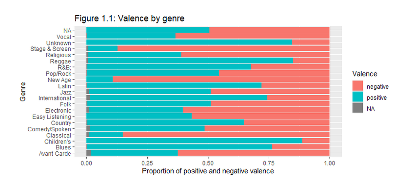

### 2. Mode by genre
When I looked at the proportion of major and minor keys across genres, the first thing I noticed is that there is a higher proportion of major keys overall. Other than the Unknown category, Country music and Children's music had the highest proportion of major modes to minor modes, which was not surprising to see. Even though Electronic is still mostly major, it had the highest proportion of minor-keyed music. Additionally, I think it would be interesting to test if mode and valence are correlated within the genres, because according to music theory, minor keys usually feel more sad or negative, whereas major keys often feel more happy or positive. 
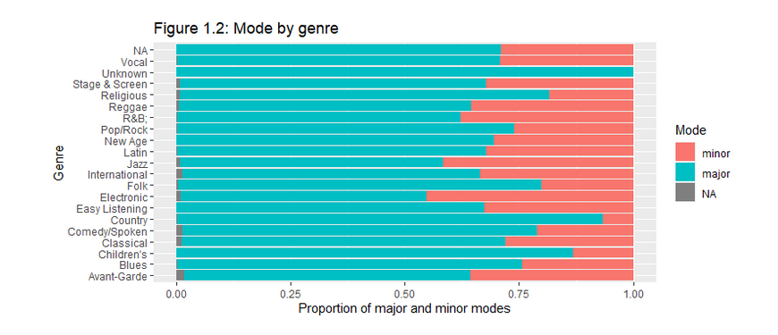

### 3. Danceability by genre
Danceability by genre (Figures 1.3 and 1.4) - The most danceable genres are Reggae, Children's, and R&B. The least danceable, unsurprisingly, are Stage & Screen, Classical, and New Age.
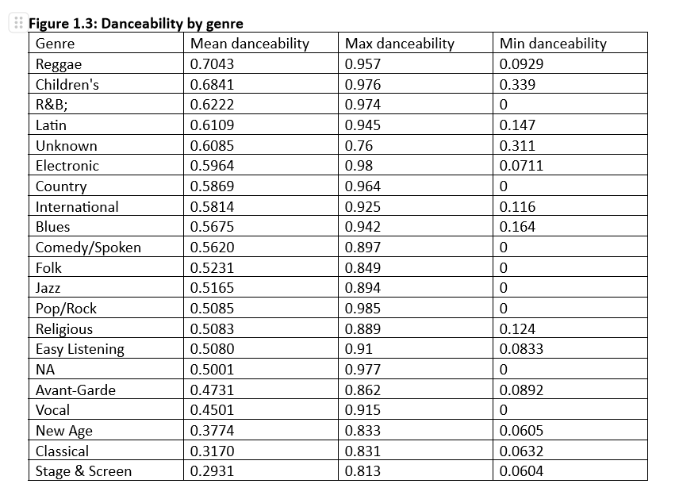
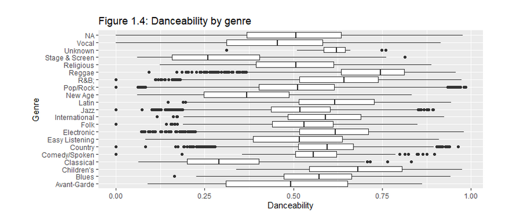

## Question 2: How do music characteristics vary over time? 

For this analysis, I chose to look at how energy, loudness, acousticness, and explicitness vary across time. 

### 1. Energy by year
I first graphed year against energy using the entire music data set, but even with the alpha transparency set to 1/10, there are too many data points overlapping and the pattern of the data is unclear. I decided to graph year and energy with the smaller data set I randomly sampled from music, music_s3, which made the graph easier to read. For the rest of the scatterplots, I graphed once using the full music data set as well as the sampled music_s3. Music energy level for the music goes up over time, and the data might even be scattered about a straight line. 
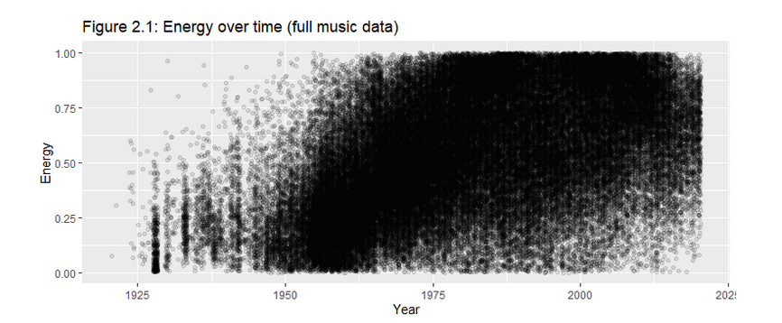
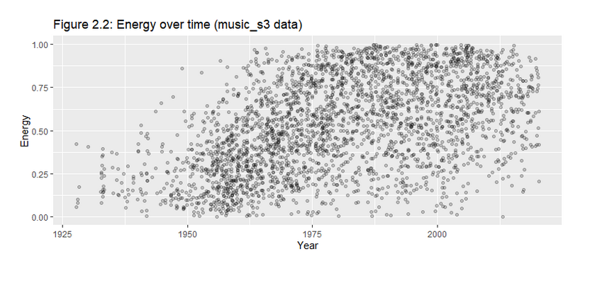

### 2. Loudness by year
(Figures 2.3 and 2.4) – As you can see in this graph, loudness also goes up over time, but less so than energy. Also, the variance of loudness is not constant - the data seems clustered heavily between 0 and -20 decibels, whereas the variance is much higher between -20 and -40 decibels. 
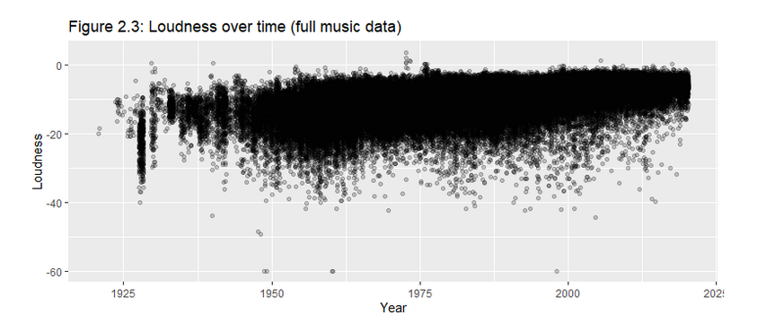
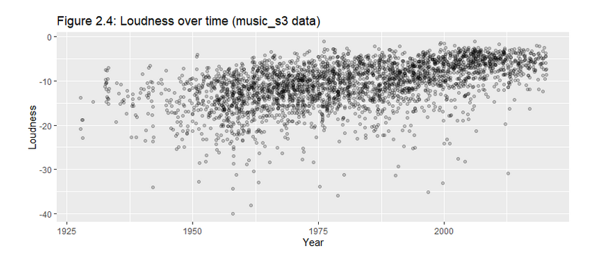

### 3. Acousticness by year
Unsurprisingly, there is a huge change in acousticness over time, with technology innovation in the music industry. This graph shows the decline in acousticness between the years ~1950 and ~1988, with the height of acousticness being around ~1960, and from then on there being more non-acoustic music than acoustic.
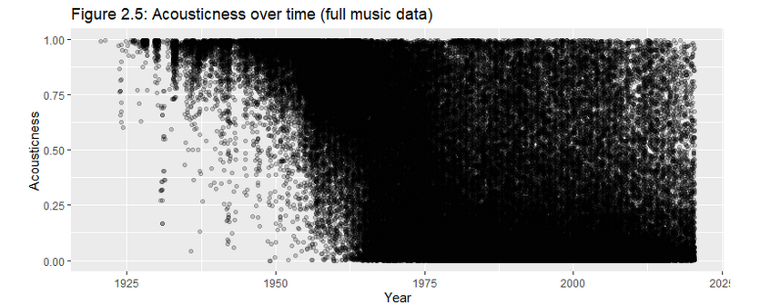
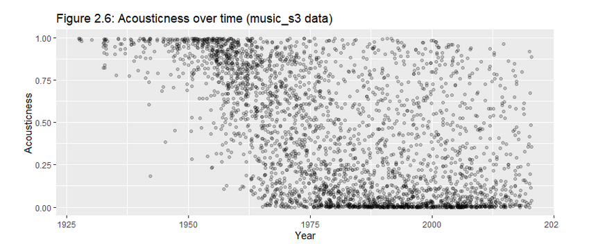

### 4. Explicitness by year
Interestingly, there is also a huge increase in explicitness over time. There are no explicit tracks from before 1956, and after 1956 until the present, there is a steady rise in the number of explicit songs. This increase in explicitness is also clear when looking at scatterplots of explicitness by year.
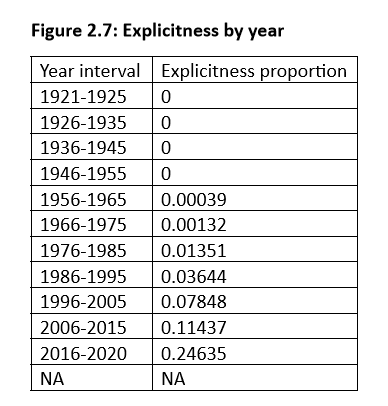
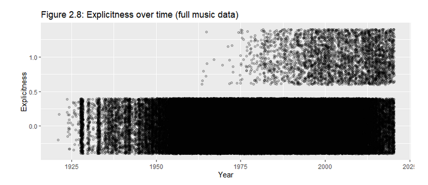
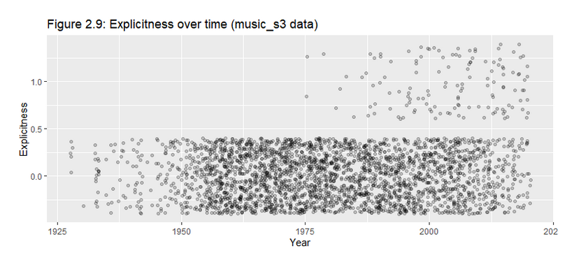

# Conclusion

